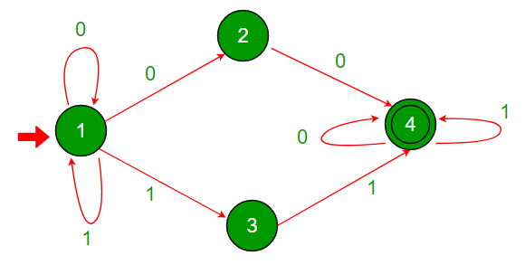

# C语言模拟非确定有限状态机(Nondeterministic Finite Automata)  

> [原文地址](https://www.geeksforgeeks.org/c-program-to-simulate-nondeterministic-finite-automata-nfa/)，背景这里不太好理解，可能翻译的不太准确

## 背景  

我们通常使用`有向图`(directed graph) 来描述一个`非确定有限自动机`(NFA)。每一条边(edge) 都被标记为`0` 或者`1`(也有可能是其他的条件)，代表着可能的状态变化。每一个顶点(vertex)都代表着一个状态。~~标记`0` 代表不接受状态，`1` 代表接受状态~~(边并不能代表状态的说啊，应该是每条边上的标记代表该边接受的输入/条件)。  

- `NFA` 需要一个有限长度的字符串作为输入。一般来说，输入字符串是`0` 和`1` 的二进制序列  
- `顶点1` 总是起始状态。我们从`顶点1` 开始，按照给定的输入字符串顺序得走过下一条边，直到字符串结尾  
- `不确定性` 一词的含义是，一个状态可能会通过不同的边连接到多个`次态`(下一个状态)。`NFA` 消耗输入字符串(序列)，而状态集合`Q` 代表着可能的状态转移  
- 如果状态集合`Q` 包含着至少一个，最后状态为接受，的状态节点(不太好理解)，那么我们就说`NFA` 接受了该输入字符串，否则就是拒绝咯  

### 示意图  

  

```txt
起始状态  节点1
接收状态  节点4(同心圆)
不接受状态  节点1、2、3
```

### 测试输入：1010  

- 起始状态为`状态1`，对于输入`1` 而言，有两种可能的次态(`状态1`、`状态3`)  

```txt
{1} 1010 --> {1,3} 010
```

- 当前状态可能是`{1,3}`，而对于输入`0` 来说：`状态1` 的次态是{`状态1`、`状态2`}；`状态1` 的次态是{}，不接受  

```txt
{1,3} 010 --> {1,2} 10
```

- 同理，当前状态可能是`{1,2}`，而对于输入`1` 来说：`状态1` 的次态是{`状态1`、`状态3`}；`状态2` 的次态是{}，不接受  

```txt
{1,2} 10 --> {1,3} 0
```

- 然后，当前状态可能是`{1,3}`，而对于输入`0` 来说：`状态1` 的次态是{`状态1`、`状态2`}；`状态3` 的次态是{}，不接受  

```txt
{1,3} 0 --> {1,2}
```

- 最后，无论是`状态1` 还是`状态2` 都不是接收状态，所以`NFA` 对于输入`1010` 是拒绝的  

### 测试输入：1100  

```txt
{1} 1100 --> {1,3} 100
{1,3} 100 --> {1,3,4} 00
{1,3,4} 00 --> {1,2,4} 0
{1,2,4} 0 --> {1,2,4}
```

- `状态4` 是接收状态，所以`NFA` 接受了输入`1100`  
- 我们很容易验证`NFA` 会接受所有包含`00` 或者`11` 的字符串  

## 程序  

### 输入格式  

下面列表代表着`NFA` 的结构(结构图在上面)：  
节点(状态)数：4  
连接：  
接受 条件 到达 `状态`  
这里接受 0 到达状态`4` 没看懂  
`1` 0 `4` 0 `1` 0 `2` 1 `1` 1 `3`  
`2` 0 `1` 0 `4`  
`3` 0 `1` 1 `4`  
`4` 1 `2` 0 `4` 1 `4`  

还是用状态表吧  

状态|0|1  
---|---|---
1|{1，2}|{1，3}
2|{4}|{}
3|{}|{4}
4|{4}|{4}  

感觉无法理解作者在讲什么了，代码先不看吧  

## 想法  

总之学会了追踪NFA 的方法，还是挺不错的
